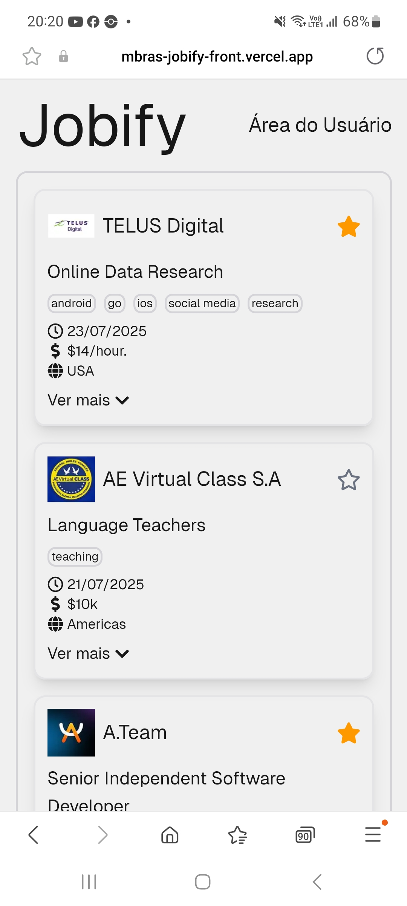
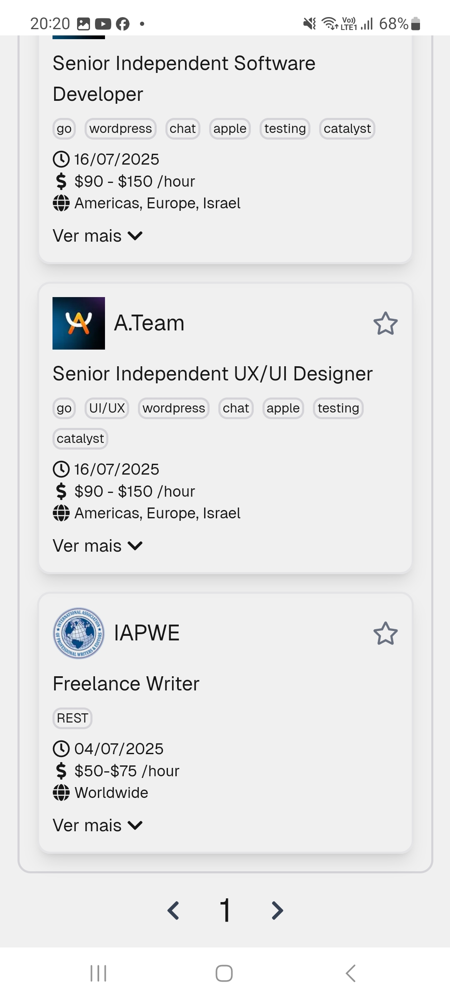

# Jobify: Desafio - Painel de Vagas de Emprego

## 🚀 Projeto
Aplicativo de listagem de vagas onde os usuários possam navegar pelas oportunidades, filtrar por categoria e visualizar detalhes. Projeto proposto pela [MBRAS](https://www.mbras.com.br).

Confira online em: [https://mbras-jobify-front.vercel.app/](https://mbras-jobify-front.vercel.app/)

<div align="center">
  
  
   
</div>

## 🛠️ Tecnologias
- 📊 Backend: [Node.js](https://nodejs.org/en/) | [Express](https://expressjs.com) | [Drizzle ORM](https://orm.drizzle.team) | [Supabase](https://supabase.com)
- 🖼️ Frontend: [React](https://pt-br.reactjs.org) | [Next.js](https://nextjs.org) | [Tailwind CSS](https://tailwindcss.com) | [chadcn/ui](https://ui.shadcn.com)

## 🧊 Cool features:
- Uso da **[API Remotive](https://remotive.io/api-documentation)** como base de dados, manipulada por backend próprio (publicado na Vercel);
- Páginas estáticas renderizadas server-side, para uma melhor performance;
- Acesso de usuários com login e senha (Auth Supabase);
- Usuários logados podem salvar suas vagas favoritas;

## 🗂️ Utilização

- 📌 Confira a lista de vagas no projeto publicado: [https://mbras-jobify-front.vercel.app/](https://mbras-jobify-front.vercel.app/)
- 📌 Faça login em [https://mbras-jobify-front.vercel.app/login](https://mbras-jobify-front.vercel.app/login) para poder salvar vagas como favoritas</br>
Usuários cadastrados:
```bash
  email: alessandro@gmail.com   password: 12345678
  email: bob@gmail.com          password: 12345678
  email: charlie@gmail.com      password: 12345678
```

### 🐑🐑 Clonando o repositório:

```bash
  $ git clone url-do-projeto.git
```

📊 Terminal 1: Backend (Servidor)
```bash
  $ cd back                   # change to this directory
  $ cp .env.example .env      # create the ".env" file like the ".env.example" file
  $ npm install               # download dependencies to node_modules
  $ npx drizzle-kit generate  # optional: create the .sql files based on the db schema
  $ npx drizzle-kit migrate   # execute SQL commands from the db/migrations files
  $ npm run dev               # start the project
```

Rotas disponíveis: checar arquivo [back/routes.http](https://github.com/Alessandro1918/mbras-jobify-challenge/blob/main/back/routes.http). Usar com a extensão [REST Client](https://marketplace.visualstudio.com/items?itemName=humao.rest-client) para o VS Code.

🖼️ Terminal 2: Frontend (Site web)
```bash
  $ cd front              # change to this directory
  $ cp .env.example .env  #create the ".env" file like the ".env.example" file
  $ npm install           # download dependencies to node_modules
  $ npm run dev           # start the project
```

Confira online em: <code>http://localhost:3000</code>
